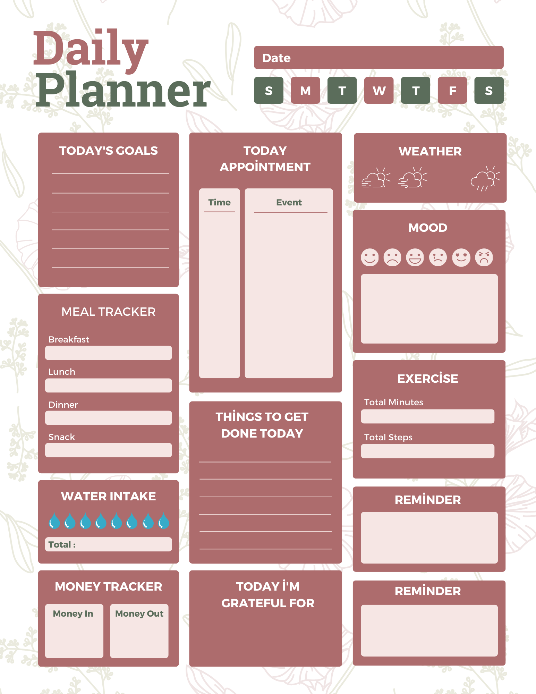

## Daily Planner

 Daily Planner is a web page built with HTML, CSS, and vanilla JavaScript as a practice exercise; it presents daily goals, meal and water intake tracking, appointments, a to-do list, weather, mood, and exercise tracking on a single screen. The project also includes various positioning exercises to practice creating a three-column layout with CSS, using Flexbox for page positioning, and arranging UI components.

---

---
